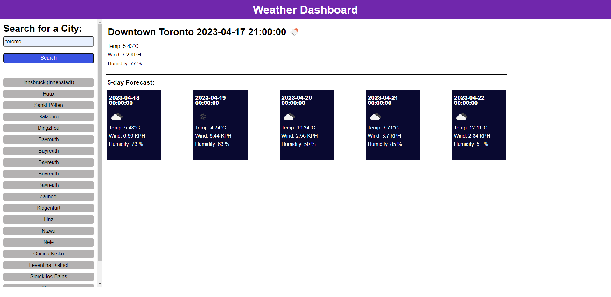

# Coding Quiz Challenge

## Description

This is the Module 6 Challenge for the boot camp. The code was made from scratch to allow the user to be able to search for a city and display its forecast. It will allow the user to search for a city and view its current weather conditions as well as a 5 day forecast. The website will also save the users recent searches to allow the user to go back and view the weather without having the need to search for the city.

Link to Deployment: https://jef1197.github.io/weather-forecast/

## Usage

1. Search For desired city in search bar

2. If city is found, website will display the current weather as well as the 5 day forecast

3. Recent searches will be saved under the seach bar and will be able to display the weather for the city if user clicks on it.

## License

Please refer to the LICENSE in the repo.